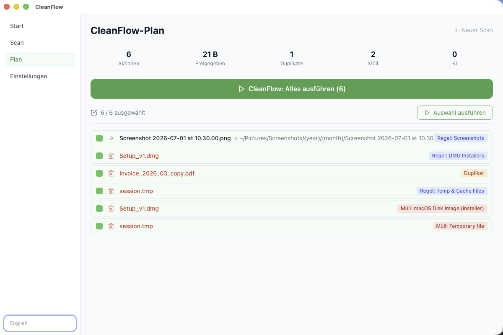

<div align="center">
  

  <h1>CleanFlow</h1>
</div>

[🇬🇧 English Version](README.md)

**Zeigt dir den ganzen Aufräumlauf, bevor er etwas anfasst, und merkt sich, was er getan hat.**

Zeig auf Downloads oder Desktop. CleanFlow wendet seine Regeln an, findet
Duplikate und Junk und legt dir einen Plan vor: jede Verschiebung, jede
Löschung, jeder Tag, aufgelistet. Du hakst ab, was passieren soll. Jede
ausgeführte Aktion landet im Journal und lässt sich später zurückdrehen.

**Nichts für dich, wenn** die Dateinamen nichts verraten und du etwas brauchst,
das in die Dateien hineinschaut, auch in Fotos. Das ist eine andere Aufgabe, und
[LifeSort](https://github.com/9t29zhmwdh-coder/LifeSort) ist die in diesem
Portfolio: es liest Dokumente und lässt ein Vision-Modell über Bilder laufen,
um nach Inhalt zu sortieren. CleanFlow arbeitet nach Regeln, das ist schneller
und vorhersehbar, aber eine Regel kann dir nicht sagen, was in `IMG_4471.jpg`
steckt.

Nichts wird ausgeführt, bevor du es auswählst, und die KI schlägt nur vor.

[](https://github.com/9t29zhmwdh-coder/CleanFlow/actions) [](https://github.com/9t29zhmwdh-coder/CleanFlow/security/code-scanning) [](https://securityscorecards.dev/viewer/?uri=github.com/9t29zhmwdh-coder/CleanFlow) [](https://www.bestpractices.dev/projects/13714)

    

> **So läuft es:** CleanFlow ist eine native Desktop-App, kein Server und kein Browser-Tool. Sie öffnet sich als eigenes Fenster und hat kein Tray-Icon und keinen Hintergrunddienst; sie läuft nur, solange das Fenster offen ist.



---

> 💾 **Download:** [macOS (DMG)](https://github.com/9t29zhmwdh-coder/CleanFlow/releases/latest/download/CleanFlow.dmg) · [Windows (Installer)](https://github.com/9t29zhmwdh-coder/CleanFlow/releases/latest/download/CleanFlow-Setup.exe) · [Linux (AppImage)](https://github.com/9t29zhmwdh-coder/CleanFlow/releases/latest/download/CleanFlow.AppImage): immer das neueste Release, nicht code-signiert/notarisiert (Gatekeeper/SmartScreen warnen beim ersten Start). Oder aus dem Quellcode bauen, siehe Erste Schritte unten.

---

**In der Praxis:** du scannst einen Ordner, prüfst einen erstellten Plan aus Verschiebungen, Papierkorb-Aktionen und Tags, und führst nur aus, was du auswählst; jede ausgeführte Aktion kann über das Journal rückgängig gemacht werden. KI (Claude oder ein lokales Ollama-Modell) unterstützt nur bei Klassifizierung und Vorschlägen; die zugrunde liegende Scan-, Regel- und Undo-Logik funktioniert auch ohne sie.

---

> 🌱 Neu hier? → [Schritt-für-Schritt-Anleitung für Einsteiger](GETTING_STARTED.md)

---

## Funktionen

| Funktion | Beschreibung |
|---|---|
| **Datei-Analyse** | MIME-Erkennung, SHA-256-Duplikate, Serien-Gruppen |
| **KI-Klassifizierung** | Optional, standardmässig aus. Claude oder ein lokales Ollama-Modell erkennt Rechnungen, Verträge, Screenshots, Code und Ähnliches anhand der Dateimetadaten (Name, Grösse, Typ), nie anhand der Dateiinhalte |
| **Clean-Up-Engine** | DMGs, .DS_Store, Temp-Dateien, Zombie-Dateien, alte Versionen |
| **Regelwerk** | Eingebaute + benutzerdefinierte Regeln |
| **Aktionsvorschau** | Jede Aktion vor der Ausführung überprüfen |
| **Ein-Klick CleanFlow** | Alle gewählten Aktionen in einem Klick ausführen |
| **Undo-System** | Journal-basiertes Rückgängigmachen jeder Aktion |
| **CLI-Modus** | `cleanflow scan`, `cleanflow organize`, `cleanflow undo` |

---

## Voraussetzungen

- [Rust](https://rustup.rs/) 1.77+
- [Node.js](https://nodejs.org/) 20+
- [Tauri CLI v2](https://tauri.app/): `cargo install tauri-cli`
- macOS / Windows / Linux

---

## Schnellstart

```bash
git clone https://github.com/9t29zhmwdh-coder/CleanFlow
cd CleanFlow

cd frontend && npm install && cd ..

# Entwicklungsmodus
cargo tauri dev

# Release-Build
cargo tauri build
```

### Nur CLI

```bash
cargo install --path crates/cf-cli

cleanflow scan ~/Downloads
cleanflow organize ~/Downloads --execute
cleanflow undo
cleanflow rules list
```

---

## Deinstallation / Aufräumen

CleanFlow ist eine eigenständige App ohne Installer und ohne Hintergrunddienst.

- **macOS:** App-Bundle löschen, danach `~/.cleanflow/` (Einstellungen, Scan-Journal) entfernen.
- **Windows:** App-Ordner entfernen, danach `%USERPROFILE%\.cleanflow\` löschen.
- API-Schlüssel liegen im OS-Schlüsselbund, nicht in `~/.cleanflow/`; bei Bedarf separat über Schlüsselbundverwaltung (macOS) oder Anmeldeinformationsverwaltung (Windows) entfernen.
- CleanFlow greift nie auf Dateien ausserhalb der explizit gescannten und organisierten Ordner zu; es gibt sonst nichts aufzuräumen.

---

## KI-Anbieter

| Anbieter | Einrichtung |
|---|---|
| **Claude (Anthropic)** | API-Key in Einstellungen eingeben → sicher im Keychain gespeichert |
| **Ollama (lokal)** | [Ollama](https://ollama.ai) installieren, `ollama pull llama3.2` ausführen |
| **Nur Regelbasiert** | Kein KI-Anbieter nötig |

Kosten: ~$0.002 pro 1.000 Dateien mit `claude-haiku-4-5`.

---

## Architektur

```
CleanFlow/
├── crates/cf-core/      # Rust: Scanner, KI, Regeln, Planner, Executor, Undo
├── crates/cf-cli/       # CLI-Binary (clap)
├── src-tauri/           # Tauri v2 Backend + IPC-Commands
└── frontend/            # React + TypeScript + Tailwind
```

---

**Autor:** [Rafael Yilmaz](https://github.com/9t29zhmwdh-coder) · **Status:** Active ·  · **Lizenz:** MIT
