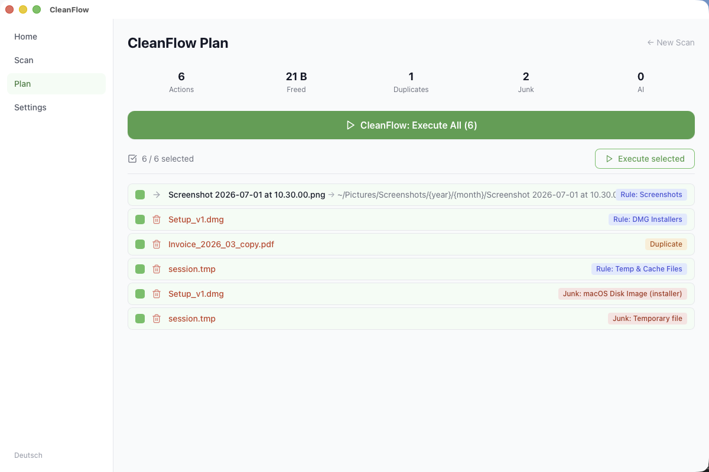

<div align="center">
  

  <h1>CleanFlow</h1>
</div>

[🇩🇪 Deutsche Version](README.de.md)

**AI-powered file organizer for macOS, Windows and Linux, built with Rust and Tauri.**

CleanFlow scans your Downloads, Desktop, Documents or any directory, classifies files with AI, detects duplicates, identifies junk, and generates an actionable plan. One click to execute; with full undo support.

[](https://www.bestpractices.dev/projects/13714) [](https://github.com/9t29zhmwdh-coder/CleanFlow/actions) [](https://github.com/9t29zhmwdh-coder/CleanFlow/security/code-scanning) [](https://securityscorecards.dev/viewer/?uri=github.com/9t29zhmwdh-coder/CleanFlow)

    

> **How it runs:** CleanFlow is a native desktop app, not a server or browser tool. It opens as its own window and has no tray icon or background service; it only runs while the window is open.



---

> 💾 **Download:** [macOS (DMG)](https://github.com/9t29zhmwdh-coder/CleanFlow/releases/latest/download/CleanFlow.dmg) · [Windows (Installer)](https://github.com/9t29zhmwdh-coder/CleanFlow/releases/latest/download/CleanFlow-Setup.exe) · [Linux (AppImage)](https://github.com/9t29zhmwdh-coder/CleanFlow/releases/latest/download/CleanFlow.AppImage): always the latest release, not code-signed/notarized (Gatekeeper/SmartScreen will warn on first run). Or build from source, see Getting Started below.

---

**In practice:** you scan a folder, review a generated plan of moves, trashes and tags, and execute only what you select; every executed action can be undone from the journal. AI (Claude or a local Ollama model) only assists with classification and suggestions; the underlying scan, rule matching, and undo logic works without it.

---

> 🌱 New here? → [Step-by-step guide for beginners](GETTING_STARTED.md)

---

## Features

| Feature | Description |
|---|---|
| **File Analysis** | MIME detection, SHA-256 deduplication, series grouping |
| **AI Classification** | Claude or a local Ollama model classifies invoices, contracts, screenshots, code, etc. |
| **Clean-Up Engine** | Detects DMGs, .DS_Store, temp files, zombie files, old versions |
| **Rule Engine** | Built-in + custom rules (e.g. "PDF + invoice → Documents/Finance/2026") |
| **Action Preview** | Review every proposed action before executing |
| **One-Click CleanFlow** | Execute all selected actions in one click |
| **Full Undo** | Journal-based undo for any executed action |
| **CLI Mode** | `cleanflow scan`, `cleanflow organize`, `cleanflow undo` |

---

## Requirements

- [Rust](https://rustup.rs/) 1.77+
- [Node.js](https://nodejs.org/) 20+
- [Tauri CLI v2](https://tauri.app/): `cargo install tauri-cli`
- macOS / Windows / Linux (Tauri v2)

---

## Quick Start

```bash
git clone https://github.com/9t29zhmwdh-coder/CleanFlow
cd CleanFlow

# Install frontend dependencies
cd frontend && npm install && cd ..

# Run in development mode
cargo tauri dev

# Build release
cargo tauri build
```

### CLI Only

```bash
cargo install --path crates/cf-cli

cleanflow scan ~/Downloads
cleanflow organize ~/Downloads --execute
cleanflow undo
cleanflow rules list
```

---

## Uninstall / Cleanup

CleanFlow is a self-contained app with no installer and no background service.

- **macOS:** delete the app bundle, then remove `~/.cleanflow/` (settings, scan journal).
- **Windows:** remove the app folder, then delete `%USERPROFILE%\.cleanflow\`.
- API keys are stored in the OS keychain, not in `~/.cleanflow/`; remove them separately via Keychain Access (macOS) or Credential Manager (Windows) if you added one.
- CleanFlow never touches your original files outside the folders you explicitly scan and organize; there is nothing else to clean up.

---

## AI Providers

| Provider | Setup |
|---|---|
| **Claude (Anthropic)** | Enter your API key in Settings; stored securely in the OS keychain |
| **Ollama (local)** | Install [Ollama](https://ollama.ai), run `ollama pull llama3.2` |
| **Rule-based only** | No AI provider required |

Cost: ~$0.002 per 1,000 files with `claude-haiku-4-5`.


---

## Built-in Rules

| Rule | Condition | Action |
|---|---|---|
| Screenshots | `Name matches Screenshot*` | → Pictures/Screenshots |
| DMG Installers | `Extension .dmg` | Trash |
| .DS_Store | `Name contains .DS_Store` | Trash |
| PDF Invoices | `PDF + AI: invoice` | → Documents/Finance/{year} |
| Temp Files | `Extension .tmp/.log/.cache` | Trash |
| Zombie Files | `Never accessed + older 90 days` | Archive |

---

## Architecture

```
CleanFlow/
├── crates/cf-core/      # Rust: scanner, AI, rules, planner, executor, undo
├── crates/cf-cli/       # CLI binary (clap)
├── src-tauri/           # Tauri v2 backend + IPC commands
└── frontend/            # React + TypeScript + Tailwind
```

---

**Author:** [Rafael Yilmaz](https://github.com/9t29zhmwdh-coder) · **Status:** Active ·  · **License:** MIT
